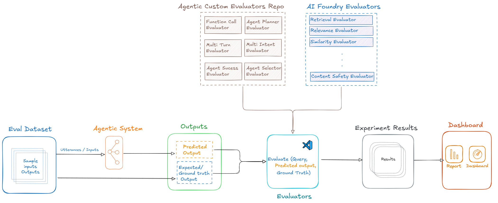
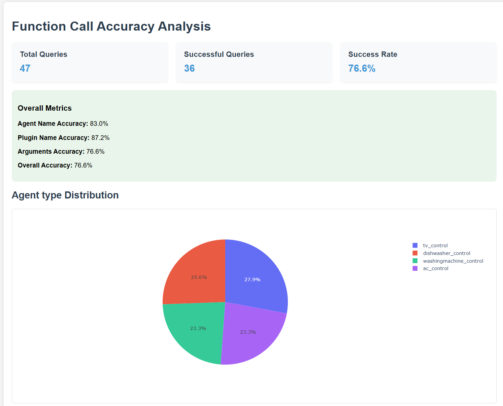
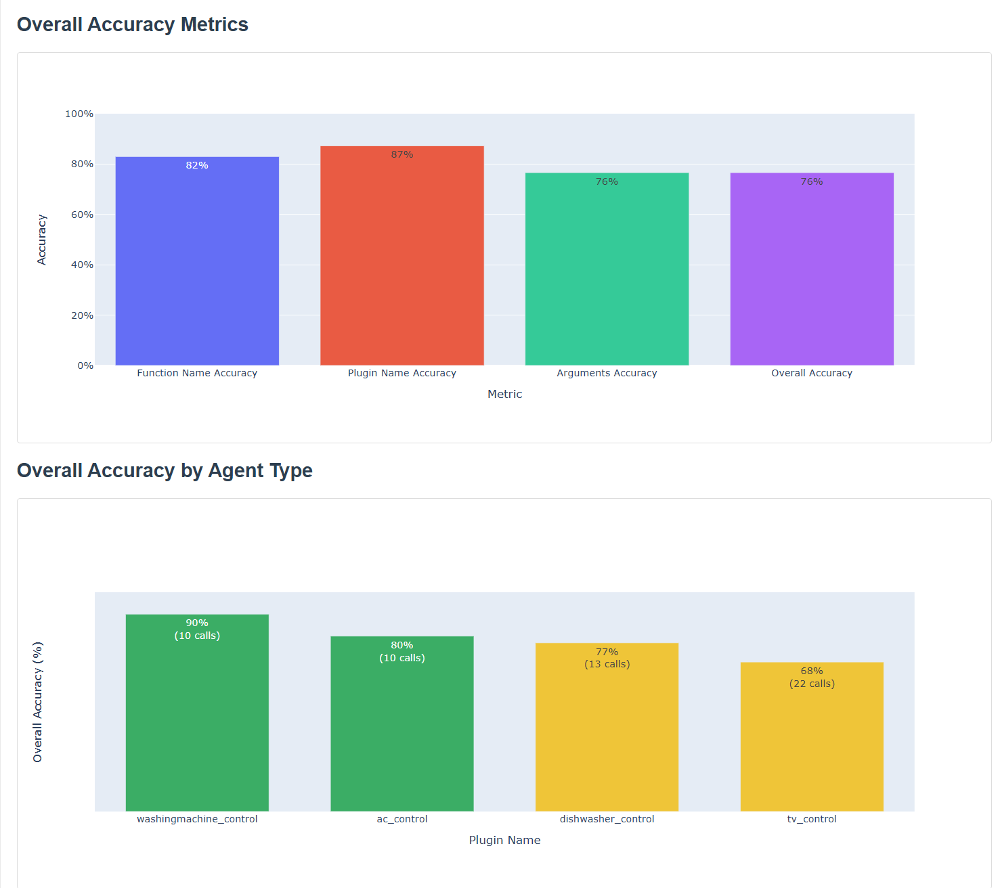
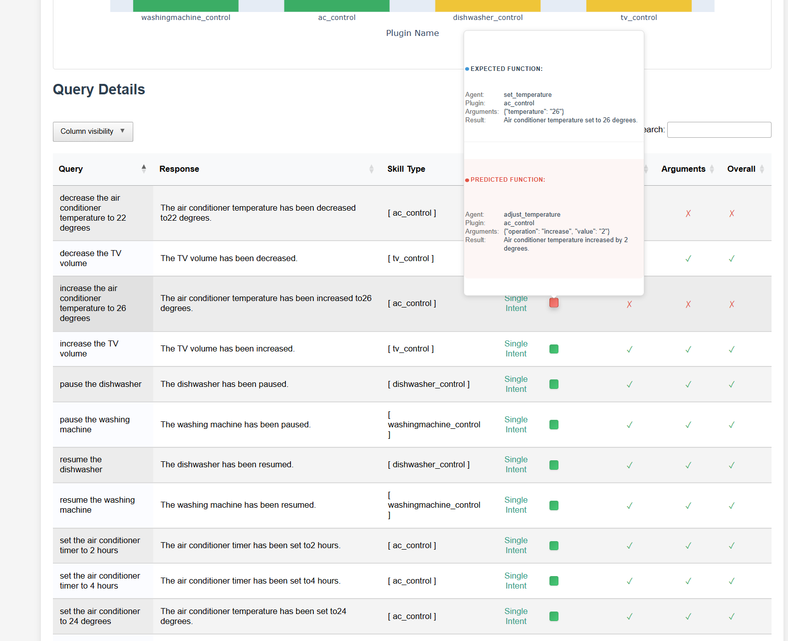

# Evaluation of Agentic Systems using Azure AI Foundry

Agents are AI models with memories that communicate via messages. They can interact with themselves, other agents, or the human user, these messages include text, multimodalities, and tools or function calls, forming a chat history/thread/trajectory.

Agentic systems can range from single agents with tool calling to complex multi-agent systems that communicate to complete tasks. Building an evaluation pipeline for such systems starts with creating ground truth datasets based on real-world usage. 

This framework provides a step-by-step approch to building a pipeline to Evaluate agentic system using Azure AI Foundry, using single agent with multiple plugins from Sematic Kernel as an example. This repository provides a reporting framework using html report locally to analyze, visualize and share the evaluation results to various stake holders. 

## 1. Agentic Evaluation Pipeline (Inner Loop)
Inputs are fed to agentic systems, and outputs—either end responses or inner workings like function calls, agent selection, and communication—are evaluated.
Extracting these inner details is crucial for robust evaluation. Evaluators compare predicted data to ground truth data, scoring them accordingly. 
Currently, specialized evaluators for agentic systems need to be custom-built, as existing AI foundry tools support RAG and chatbot applications only. 
Finally, evaluation results are stored and visualized both in AI Foundry's evaluator dashboard and a custom HTML Report built using Jinja2 template. 

Agentic-Eval-Pipeline is a Python-based framework for building and evaluating agentic systems.

### Evaluation Pipeline Diagram

Below is a visual representation of the evaluation pipeline:




## 2. Folder Structure

The repository is organized as follows:

```
project-root/
│
├── src/                # Source code for the framework
│   ├── __init__.py     # Makes src a package
│   ├── main.py     # Core pipeline logic
│   ├── data_generator/ # Code for generating data
│   ├── data_transforms/ # Code for transforming data
│   ├── evaluator/      # Code for evaluation logic
│   ├── datasets/       # Code for dataset management
│   └── report_generator/ # Code for generating reports
│
├── config/             # Configuration files
│   └── config.yaml     # YAML configuration file
│   └── mapping_schema.json  # Schema for mapping agent output to ground truth function call
│
├── assets/             # Assets like images or diagrams
│   └── Eval-pipeline.png # Diagram of the evaluation pipeline
│   ├── Report-screenshots1.png # Overview of evaluation metrics
│   ├── Reports-screenshot2.png # Agent communication visualization
│   └── Reports-screenshot3.png # Function call analysis
│
├── requirements.txt    # Python dependencies
├── .gitignore          # Git ignore rules
└── README.md           # Project documentation
```

## 3. Prerequisites
Before getting started, ensure you have the following:

- Azure Subscription: Access to an Azure subscription with the necessary permissions.
- Azure CLI: Installed and configured on your local machine.
- Azure AI Foundry - Hub and Project created with model (GPT4o) deployed and Blob storage link set up. Refer [Azure AI Foundry Documentation](https://learn.microsoft.com/en-us/azure/ai-foundry/what-is-ai-foundry#work-in-an-azure-ai-foundry-project).
- Python 3.11 or above
- Git: For version control and cloning the repository.

## 5. Azure Features Used
 - Azure AI Foundry - GPT4o, Evaluation, tracing
 - App Insights - logging and tracing


## 6. Installation
1. Clone the repository:
   ```bash
   git clone https://github.com/vvshankar78/Agentic-Evals.git
   ```
2. Navigate to the project directory:
   ```bash
   cd Agentic-Evals
   ```
3. Set up a virtual environment:
   ```bash
   python -m venv venv
   source venv/bin/activate  # On Windows use `venv\Scripts\activate`
   ```

4. Install dependencies:
   ```bash
   pip install -r requirements.txt
   ```
5. Log in to Azure using Azure CLI:
   ```bash
   az login
   ```
6. Run the main pipeline:
   ```bash
   python src/main.py
   ```
7. Customize the pipeline by modifying the configuration file located in the `config/` folder. Update `config/settings.py` or `config/config.yaml` to adjust parameters such as model settings, data paths, or evaluation criteria as per your requirements. The pipeline steps defined in config.yaml file is shown below. The pipeline can continue from previous step (if already run). For example if data_generation is already run, we can continue by removing data_generation from pipeline in config. 
   ```bash 
   pipeline:
      steps:
         - data_generation
         - data_transformation
         - evaluation
         - reporting
   ```


### Sample Outputs

Once you run the main pipeline, a sample evaluation report is generated and saved as an HTML file. 

You can find the generated evaluation report HTML file attached below:
```
src/report/evaluation_report.html
```

This report provides detailed insights into the evaluation results, including:

- **Agent Responses**: Comparison of predicted responses with ground truth.
- **Function Calls**: Analysis of function call accuracy and relevance.
- **Agent Communication**: Visualization of agent interactions and message flows.
- **Evaluation Metrics**: Scores and metrics for each evaluation criterion.

Open the `evaluation_report.html` file in your browser to analyze and share the results with stakeholders.

### Report Screenshots

Below are the screenshots of the sample evaluation report generated by the pipeline:

#### Screenshot 1: Overview of Evaluation Metrics



#### Screenshot 2: Agent Communication Visualization


#### Screenshot 3: Function Call Analysis



## Future Developments
- Add multi agent sample to the data generator. 
- Add multi agent evaluation approches - multi turn, multi agent group chat, planner etc.,
- upgrade html template to provide accomodate additional eval metrics for agentic systems. 
- Explore other dashboarding tools like PowerBI that can be integrated with 

## Links
AI Foundry: https://learn.microsoft.com/en-us/azure/ai-foundry/what-is-ai-foundry#work-in-an-azure-ai-foundry-project